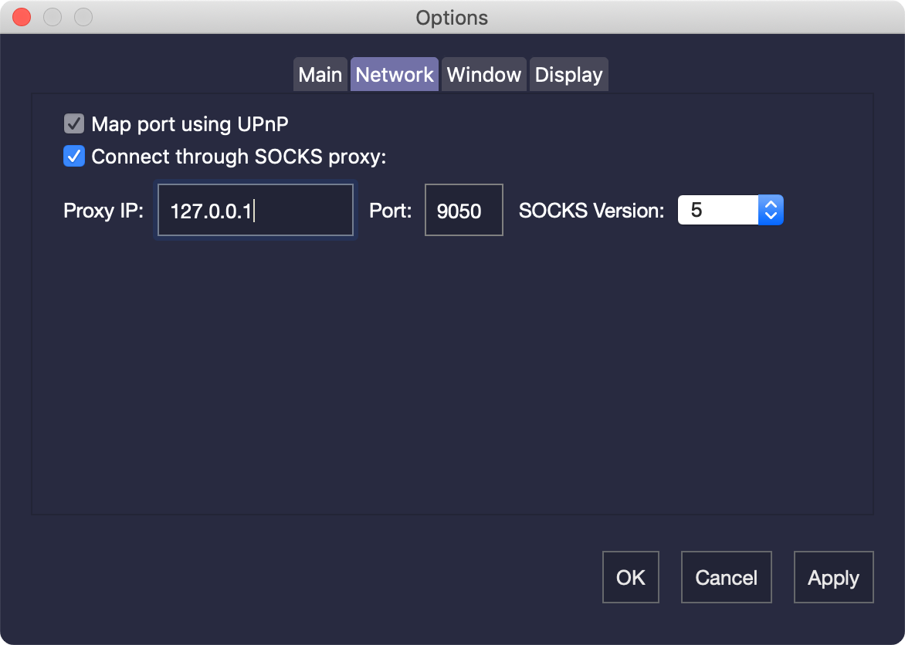

# Windows: Syncing Guide

The purpose of this tutorial is to give you every single step to ensure you can get your wallet functioning properly.


99% Of the time, Non-syncing wallets are usually resolved by simply adding a .conf file to your wallet.


1. Download, extract, and run the DeepOnion Wallet. a. Wallet must be ran at least once in order for appdata directory to create b. Download wallet [here](https://deeponion.org/index.php#download). c. Details on extraction and running process can be found in the first part of [this tutorial](https://deeponion.org/community/threads/deeponion-wallet-installation-tutorial.19/).
2. Make sure firewall is not blocking DeepOnion.

**Process 1: Add .conf file**

1. Navigate to [this link](https://deeponion.org/DeepOnion.conf.php).
2. Follow either the [video tutorial](https://youtu.be/nc8Eh3OVkfo) or the [text tutorial](https://deeponion.org/community/threads/deeponion-tor-wallet-creating-conf-file.63/) that are linked and embedded into the page.
3. Restart the DeepOnion wallet.
4. Still not working? See **Process 2.**

**Process 2: Verify TOR connectivity through ISP**

1. Download the [Official TOR Web Browser](https://www.torproject.org/download/download-easy.html.en) and see if you can connect and browse. a. If you can connect, continue to **Process 3.**
2. Still not working? From here you will have to connect to a different ISP in order to sync/use wallet or create/use a VPN to run wallet. There might be other options, but those would be your two best bets.

**Process 3: Fresh Copy**

1. [Wipe and install a fresh copy of the DeepOnion Wallet](https://deeponion.org/community/threads/important-tutorial-how-to-install-a-fresh-copy-of-deeponion-wallet.81/).
2. Still not working? See **Process 4.**

**Process 4: Manually Create DeepOnion Appdata Directory**  
  
This process is very similar to the wipe and install fresh copy of DeepOnion wallet scenario. However, it seems through a long process of troubleshooting that some versions of Windows operating system may NOT be able to create a proper version of the DeepOnion appdata directory during initial launch. This doesn’t seem to be a bug in DeepOnion wallet software, but specifically an issue in certain versions of Windows. Known versions of Windows that might make this error are Windows 8.1 and Windows 10 version 1511 \(pre-Creators edition\). Perhaps others.  
  
Though this isn’t certain a Windows issue, I have had 100% successful results on different occasions having users download the DeepOnion appdata directory in its entirety except blockchain and wallet.dat files, then manually creating the DeepOnion appdata folder.

1. [Backup wallet.dat file](https://deeponion.org/community/threads/deeponion-tor-wallet-how-to-backup-import-wallet-data.76/) \(If applicable\). a. Do not worry about this is you do not already have coins.
2. Download the DeepOnion appdata directory [here](https://mega.nz/#!hnZyzLzQ!HSFIVkY1qv1uI37fNaQsOWyYOaI58vuM59Sz3ZSU4S0).
3. Unzip and extract folder to a destination of your choosing.
4. Open File Explorer and type %appdata% in the search bar then click Enter.
5. Move unzipped and extracted DeepOnion appdata directory that you previously download into this folder..
6. Add [updated .conf file](https://deeponion.org/DeepOnion.conf.php).
7. Restart DeepOnion wallet – Wait for connections and let sync.

That’s it! If you honestly cannot get the wallet running after this point, maybe the best bet for you is to run a VPN or attempt a fresh Windows 10 version 1703 installation and go from there.  
  
**Edit: If you wish to download and configure a proxy server, follow this after with your specifics:**

1. In your DeepOnion wallet, navigate to Settings – Options – Network.
2. Check mark “Connect through SOCKS proxy” – Apply – OK.
3. Restart Wallet.

